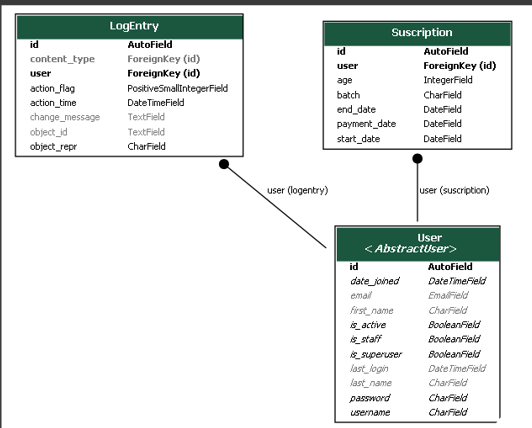
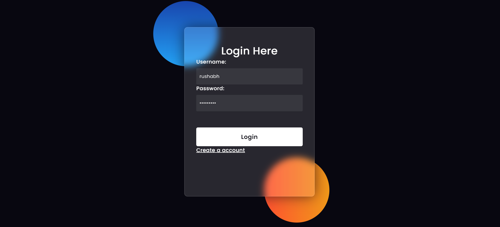
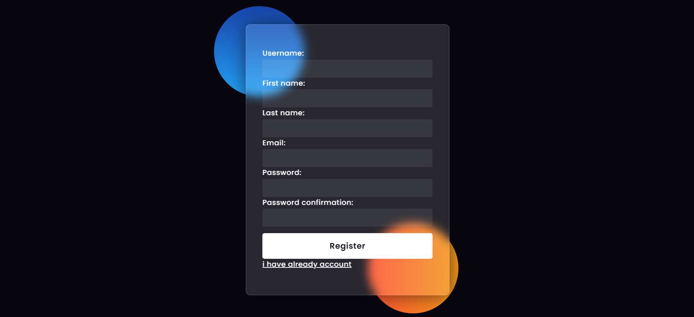
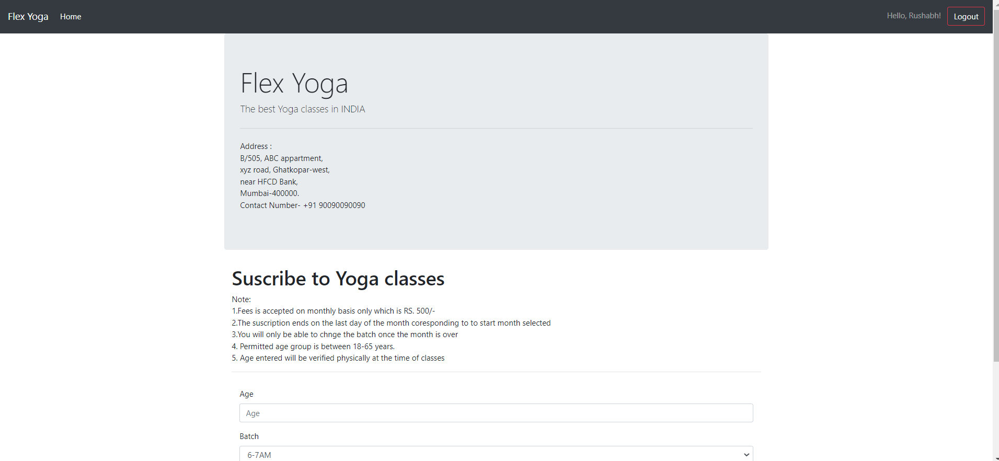
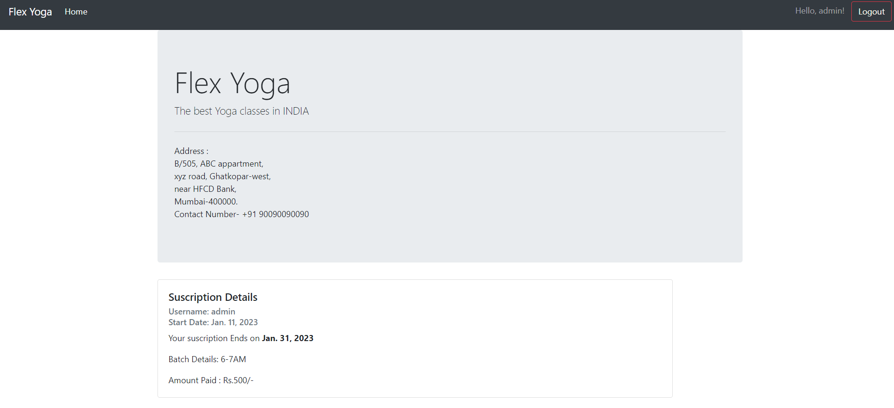

<hr>
<h1 align="center">Hi , Welcome to Flex Yoga</h1>


<p align="center">
  <em>
    Flex Yoga is an webapp where the people interested to join flex yoga classes can come and register and sucribe to the classes.
 
  </em> 

</p>

<br><br>
 

&nbsp;***TECH-STACK***
<p align="left">
  
  <code></code>
  <code>  </code>
  <code>  </code>
  <code>  </code>
  <code>  </code>

  <hr>
  </p>
  
 ---

 ### Website link
 <p>The website is deployed at https://flexyoga.azurewebsites.net/</p>
 
 ## Admin Credentials
 <p>Link to the admin site http://flexyoga.azurewebsites.net/admin </p>
 
 ##### Username: admin
 ##### Password: admin@123
 ---

 ### Entity Relationship Diagram
 
 ---

 ### Assumptions and contitions
 * Age limit is 18-65 years
 * Suscription ends at the last day of each month.
 * There are 4 batches and batches can be changed only after the monthly suscription ends.
 * Here we Assume that the fees is already paid by checking the ckeckbox in the form.
---
 
 ### Instructions to run
 * Install virtual environment using the following command
 ```
 pip install virtualenv
```
* Create new virtual environment
```
python -m venv <name_of_your_environment>
```
* Activate your virtual environment
```
<name_of_your_environment>\Scripts\activate.bat
```
* Install project dependencies
```
pip install -r requirements.txt
```
* Run the server inside project folder and go to the url that appears on your command prompt
```
python manage.py runserver
```
 
---
<h2 align="center">
Snapshots of the project
</h2>
  

  
  
  


---
<h3 align="center"><b>Developed with :heart: by <a href="https://github.com/rushabhgandhi13">Rushabh Gandhi</a>
